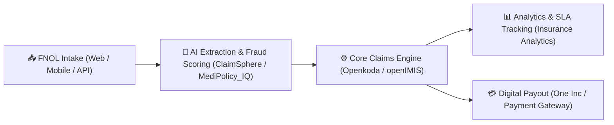

  

# 🚀 Awesome Claims Management Ecosystem

    

> **A curated ecosystem of top SaaS platforms, AI claims automation tools, and open-source claims processing systems for insurance carriers, MGAs, TPAs, and claims adjusters.** 📊 Seamlessly handle First Notice of Loss (FNOL), claims adjudication, fraud detection, medical coding, and digital payouts across P&C (Property & Casualty), Health, Auto, and Life insurance lines.

**📅 Last updated:** September 2026

---

## 📌 Table of Contents

- [📈 Market Size & Industry Dynamics](#-market-size--industry-dynamics)
- [🏢 SaaS & Cloud Claims Platforms](#-saas--cloud-claims-platforms)
- [💻 Open-Source Claims Systems & Projects](#-open-source-claims-systems--projects)
- [💡 Custom Claims Architecture Framework](#-custom-claims-architecture-framework)
- [🤝 How to Contribute](#-how-to-contribute)
- [💖 Support & Sponsorship](#-support--sponsorship)
- [⚠️ Disclaimer](#%EF%B8%8F-disclaimer)
- [📈 Star History](#-star-history)

---

## 📈 Market Size & Industry Dynamics

The global **Claims Management Software Market** is estimated at **$43.58 Billion in 2024–2025** and is projected to reach **$103+ Billion by 2035** (growing at a CAGR of ~8.5%). The market structure is **moderately fragmented**: enterprise P&C core administration is heavily concentrated around market leaders (e.g., Guidewire, Duck Creek), while specialized sub-sectors (such as AI fraud detection, auto physical damage assessment, and healthcare claim adjudication) are highly fragmented with rapid innovation from InsurTech startups and open-source initiatives. 🌐

---

## 🏢 SaaS & Cloud Claims Platforms

Below is a curated comparison of leading SaaS claims management platforms, sorted by **company scale (Annual Revenue / Market Valuation, Descending)**. 💰

| SaaS Platform | Scale (Est. Revenue / Valuation) 📏 | Pricing Tier (Starting Rate) 💵 | Free Tier & Trial Limits ⏳ | Key Features & Core Focus 🎯 |
| :--- | :--- | :--- | :--- | :--- |
| **[Guidewire ClaimCenter](https://www.guidewire.com/)** | **~$1.48B Revenue** ($11.5B Market Cap) 🏢 | Enterprise Subscription (Custom, typically starting $100k+/yr for tier-1 carriers) 💰 | No free tier; demo & custom sandbox sandbox provided upon enterprise inquiry 🚫 | 🏆 Industry standard for P&C claims lifecycle, automated FNOL, fraud scoring, and vendor management. |
| **[Duck Creek Claims](https://www.duckcreek.com/)** | **~$2.6B Valuation** (Acquired by Vista Equity) 🏢 | Enterprise Subscription (Custom quote based on DWP / claims volume) 💰 | No free tier; guided interactive demo & enterprise sandbox on request 🚫 | ⚡ Low-code, configuration-driven P&C claims intake, investigation, and settlement workflows. |
| **[Symbility](https://www.symbilitysolutions.com/)** | **~$1.8B Valuation** (Part of CoreLogic / Stone Point) 🏢 | Per-User License + Usage-Based Valuation Fees (Custom contract) 💰 | No free tier; tailored product demonstrations for carrier teams 🚫 | 🏠 Property & damage claims assessment, mobile field inspection tools, and repair estimating. |
| **[Origami Risk](https://www.origamirisk.com/)** | **~$2.1B Valuation** (Spectrum Equity Backed) 🏢 | SaaS Subscription (Custom quote based on module selection) 💰 | No free tier; personalized sales demo & sandbox testing available 🚫 | 🛡️ Integrated RMIS, enterprise risk management, safety compliance, and casualty claims workflows. |
| **[Mitchell / Enlyte](https://www.mitchell.com/)** | **~$1.0B Revenue** (Enlyte Parent Group) 🏢 | Enterprise Licensing & Per-Estimate Fees (Custom contract) 💰 | No free tier; enterprise demonstration & proof of concept available 🚫 | 🚗 Auto physical damage claims processing, repair shop workflow, and casualty medical claims auditing. |
| **[Sapiens Claims](https://sapiens.com/)** | **~$510M Revenue** ($1.6B Market Cap) 🏢 | Core System Licensing (Custom quote by line of business) 💰 | No free tier; request-based executive demo & trial access 🚫 | 🌐 Multi-line claims management supporting P&C, workers' comp, and life insurance across global markets. |
| **[Majesco Claims](https://majesco.com/)** | **~$250M Revenue** (Thoma Bravo Backed) 🏢 | Cloud SaaS Subscription (Custom quote per tier) 💰 | No free tier; carrier proof of concept & demo environment on demand 🚫 | ☁️ Cloud-native claims administration seamlessly integrated with Majesco P&C and L&A core suites. |
| **[Snapsheet](https://www.snapsheetclaims.com/)** | **~$85M Revenue** (Privately Held) 🏢 | Usage-Based Fee per Claim File (Custom tier pricing) 💰 | No free tier; 14-to-30 day structured enterprise pilot / trial on request ⏳ | 📸 Virtual auto appraisal, automated claims workflow, digital communication, and virtual payments. |
| **[OneShield](https://oneshield.com/)** | **~$65M Revenue** (Privately Held) 🏢 | SaaS License & Implementation Fee (Custom contract) 💰 | No free tier; scheduled carrier demonstration & evaluation environment 🚫 | ⚙️ Configurable claims administration, rules engine, and real-time decisioning for regional carriers & MGAs. |
| **[One Inc ClaimsPay](https://www.oneincsystems.com/)** | **~$60M Revenue** (Privately Held) 🏢 | Transaction-Based Pricing (% + Per-Payout Fee) 💰 | No free tier; test sandbox access during implementation onboard 🚫 | 💳 Digital claims payout network supporting instant debit, ACH, Venmo, and direct vendor disbursements. |
| **[Claimatic](https://claimatic.com/)** | **~$15M Revenue** (Privately Held) 🏢 | Monthly SaaS Fee per Active Adjuster (Custom tiering) 💰 | No free tier; live demo and historical claim data trial run 🚫 | 🧠 AI-driven intelligent claims routing, real-time adjuster geographic assignment, and workload balancing. |
| **[FileHandler](https://www.filehandler.com/)** | **~$10M Revenue** (JW Software) 🏢 | SaaS Subscription / Annual License (Custom quote) 💰 | No free tier; customized live system demonstration on request 🚫 | 📁 Comprehensive claim file management, FNOL intake, check writing, and loss reporting for TPAs and self-insureds. |

---

## 💻 Open-Source Claims Systems & Projects

Explore production-grade open-source tools, AI agent frameworks, and reference architectures for claims management. **Sorted by GitHub_Stars (Descending)**. ⭐

- **[openIMIS](https://github.com/openimis)**   
  🏥 **Digital Public Goods Certified Health Insurance Claims Platform**. Purpose-built for social health protection and health financing schemes. Features digital claims creation, submission, and automated adjudication with an **AI-assisted claim review module**. Interoperable with HL7 FHIR, DCI, OpenMRS, and DHIS2. *Deployed in 13+ countries serving 25.5M+ beneficiaries.* 🌍 (Open Source / MPL 2.0)

- **[Openkoda](https://github.com/openkoda/openkoda)**   
  📦 **Open-Source Core Insurance Platform with Built-in Claims Module**. Built on Java, Spring Boot, and PostgreSQL. Includes dynamic data model builders, automated REST & GraphQL APIs, document generation, business process automation, visual dashboard builders, and multi-tenancy. Ideal for P&C insurers and MGAs. 🛠️ (MIT License)

- **[Digital Claims Management System](https://github.com/nikithagottimukkula/Digital-Claims-Management-System)**   
  ⚡ **Enterprise-Grade Cloud Claims Application**. Built with React + Spring Boot on AWS. Features secure claims intake, multi-step FNOL forms, AWS S3 document attachments, role-based workflows for adjusters and managers, SLA tracking, and audit logging. ☁️ (Open Source)

- **[Insurance Analytics Platform](https://github.com/aathifpm/insurance-analytics)**   
  📊 **Claims Analytics & Machine Learning Fraud Detection**. React 18 + Python Flask stack featuring claim tracking, document processing, supervisor approval queues, and **Scikit-learn ML models for automated fraud risk scoring**. 🔍 (MIT License)

- **[MediPolicy_IQ](https://github.com/ganesh2005-G/MediPolicy_IQ)**   
  🧠 **AI-Powered Health Insurance Claims Adjudication Intelligence**. Complete claims automation featuring OCR invoice/prescription extraction, ICD-10 / CPT medical code validation, dynamic Coordination of Benefits (COB), policy rule evaluation, risk scoring (0-100), and RAG policy Q&A assistant. Built with FastAPI + Streamlit. 🚀 (MIT License)

- **[ClaimSphere AI](https://github.com/palsure/claimsphere-ai)**   
  🤖 **Multi-Agent AI Claims Processing Engine**. Powered by CAMEL-AI agent framework. Automates document verification, duplicate claim detection, PaddleOCR text extraction, ERNIE 5.0 Thinking API integration, and auto-approval workflows. 🛡️ (Open Source)

- **[Insurance Agentic Mesh](https://github.com/vishalmysore/insuranceagenticmesh)**   
  🌐 **Java-Based AI Agent Mesh for Claims & Insurance**. Features a standalone **Claims Processing Server** (port 7872) with MCP & A2A protocol support for claim submission, status querying, automated approval/rejection, and digital payouts. Built on Spring Boot 3.2.4. ⚙️ (Open Source)

- **[Vehicle Insurance Claim Workflow System](https://github.com/NotMakerWebSite/loIcMUBBjzoR)**   
  🚘 **Auto Insurance Claims Processing & Field Survey System**. Full-stack solution (Java/Spring Boot + Vue + MySQL) with roles for insured clients, accident field investigators, and claims managers. Covers accident reporting, site surveys, damage assessment, and payout approvals. 📝 (Open Source)

---

## 💡 Custom Claims Architecture Framework

When building a modern, self-hosted, or hybrid claims management system:

1. **Core Platform**: Use **Openkoda** for P&C / General Claims core administration or **openIMIS** for Health Insurance management.
2. **AI & Fraud Automation**: Integrate **ClaimSphere AI** or **MediPolicy_IQ** for intelligent OCR document parsing, medical coding checks, and risk scoring.
3. **Agentic Workflows**: Deploy **Insurance Agentic Mesh** for autonomous claims routing, adjuster assignment, and status updates.
4. **Data Layer**: Deploy on **PostgreSQL** with **Docker** / **AWS S3** containerization.

---

## 🤝 How to Contribute

Contributions are warmly welcomed! Help us keep this ecosystem complete and up to date:

1. **Fork** this repository.
2. Add your project or SaaS tool to `README.md` adhering to the table format.
3. Provide accurate company scale, pricing detail, open-source badges, and official links.
4. Submit a **Pull Request** with a brief overview.

---

## 💖 Support & Sponsorship

If you find this repository helpful, please consider supporting the project! 🌟

- **Star this repo**: Click the ⭐ star button at the top right of this page.
- **Share**: Spread the word to fellow InsurTech developers, claims adjusters, and insurance engineers.
- **Sponsor**: Support ongoing open-source curation and development via [GitHub Sponsors](https://github.com/sponsors/ishandutta2007). ☕

---

## ⚠️ Disclaimer

- This repository is a **community-curated index** for informational and educational purposes. It does not constitute commercial endorsement.
- Claims management systems process sensitive Personal Identifiable Information (PII) and Protected Health Information (PHI). Always ensure strict compliance with HIPAA, GDPR, PCI-DSS, and local insurance regulatory standards.
- **Open-Source Reality**: While open-source frameworks provide robust foundational building blocks (e.g., Openkoda, openIMIS), full end-to-end enterprise claims operations (regulatory reporting, complex reinsurance, carrier integrations) typically require custom engineering or enterprise SaaS solutions.

---

## 📈 Star History

---

  <b>Built for Claims Managers, InsurTech Developers, Adjusters, and MGA Operators. 🌟</b> 
  <i>Promoting open, transparent, and intelligent claims management technology.</i>

